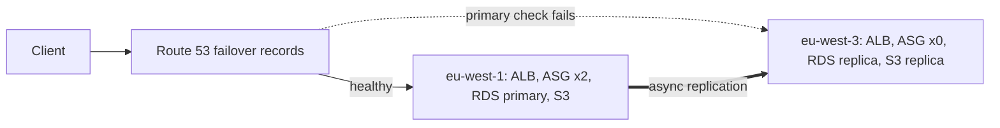

# AWS Multi-Region Pilot Light


A deliberately simple notes API deployed across two AWS regions in the pilot light disaster recovery pattern: Route 53 failover routing, an RDS cross-region read replica, S3 replication, and a secondary compute tier that scales from zero. The application is small on purpose. The value of this repository is the architecture, the measured trade-offs, and the [Well-Architected review](docs/well-architected-review.md) that walks through all six pillars against the actual Terraform.

## The idea

Most disaster recovery write-ups stop at the diagram. This project goes the rest of the way: the whole stack is real, reproducible Terraform, the failover is scripted and timed so every drill produces a measured RTO instead of an estimate, and every architectural decision is written down with what it buys and what it costs. Where a choice is only defensible at demo scale, the documentation says so instead of pretending.

The pattern in one paragraph: eu-west-1 serves all traffic. eu-west-3 continuously receives every database write and S3 object but runs zero application instances. Route 53 probes the primary region every 10 seconds and flips DNS on its own when it fails. A human then promotes the read replica and scales the dormant Auto Scaling group, both through one script, and the same application serves from the second region under the same URL.

## Key numbers

| Metric | Value |
| ------ | ----- |
| RPO target | under 1 minute, asynchronous replication lag in practice seconds |
| RTO target | under 30 minutes, expected 10 to 15, dominated by RDS promotion |
| DNS failover | automatic, about 30 seconds of detection plus TTL |
| Standby compute cost | zero instances between incidents |
| Full standby region cost | about 72 USD per month at demo scale, detail in the [cost analysis](docs/cost-analysis.md) |

## Architecture



The full picture, including the seven-link chain from a failing database query to a DNS flip, is in [docs/architecture.md](docs/architecture.md).

## Repository layout

| Path | Contents |
| ---- | -------- |
| app/ | The FastAPI notes service, its tests, and the reasoning behind its health endpoints |
| terraform/ | The complete two-region infrastructure: network, database, storage, compute and dns modules composed in main.tf |
| scripts/ | The timed failover script |
| docs/ | Architecture, the six pillar Well-Architected review, the cost analysis and the failover runbook |

## Deploying it

You need a Route 53 public hosted zone, Terraform 1.7 or later and AWS credentials with administrative access to a sandbox account.

```bash
cd terraform
cp terraform.tfvars.example terraform.tfvars
# set domain_name and hosted_zone_id, optionally alarm_email
terraform init
terraform apply
```

The apply takes 20 to 30 minutes, most of it RDS creating the primary instance and then the cross-region replica. When it finishes, the api_url output serves the API from the primary region:

```bash
curl -si https://<your domain>/health | grep -i x-serving-region
```

Expect roughly 170 USD per month while it runs. Destroy it when you are done experimenting; everything rebuilds from this repository.

## Testing without an AWS account

The failover logic can be exercised on a laptop before spending anything:

```bash
./scripts/local-drill.sh
```

The script builds the whole pattern locally with Docker, a PostgreSQL primary, a real streaming replica standing in for the RDS cross-region replica, and both regional instances of the actual API. It then kills the primary database, verifies that the primary health endpoint goes red (the signal Route 53 acts on), promotes the replica and measures the time to the first accepted write and whether any pre-disaster data was lost. It runs in about half a minute and cleans up after itself. The first run of this drill caught a real bug, schema initialization crashing against a read-only replica, which is exactly what drills are for.

## Running a failover drill

Break the primary region however you like, the honest way being to scale its Auto Scaling group to zero and watch /health go red. Route 53 flips DNS without you. Then:

```bash
./scripts/failover.sh
```

The script promotes the replica, scales the secondary from zero, waits for health, and prints the elapsed time of every step. The [runbook](docs/failover-runbook.md) covers the decision matrix, the manual path, the verification steps and failback, and keeps a drill log because an untested runbook is a hypothesis.

## Reading order

1. [docs/architecture.md](docs/architecture.md) for what exists and why the failover chain is shaped the way it is
2. [docs/well-architected-review.md](docs/well-architected-review.md) for the six pillars and every trade-off with its price
3. [docs/cost-analysis.md](docs/cost-analysis.md) for the numbers, including the admission of where the pattern does not pay off
4. [docs/failover-runbook.md](docs/failover-runbook.md) for the operational reality

## Known limits

This is a demo-scale reference, not a production template. The RDS primary is single AZ to halve database cost, instances clone this repository at boot instead of using a baked AMI, there is no WAF and no centralized logging, and Terraform state is local. Each of these is discussed, with what production would do instead, in the review.

## License

MIT. See [LICENSE](LICENSE).
