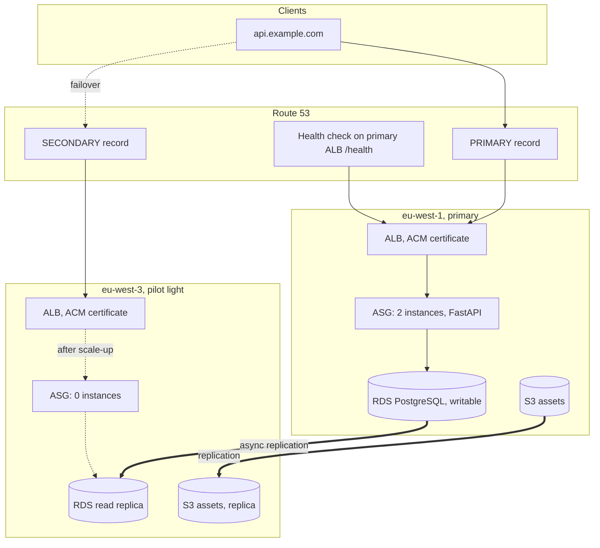

# Architecture

## The system in one paragraph

A notes API runs behind an Application Load Balancer in eu-west-1, backed by PostgreSQL on RDS and an S3 bucket for attachments. A second region, eu-west-3, holds a continuously replicating copy of all data but almost no running compute. Route 53 health checks decide which region the public domain resolves to. When the primary region fails, DNS flips on its own, a human promotes the database replica and scales the dormant Auto Scaling group, and the same application serves from Paris instead of Dublin. The client never changes its URL.

## Diagram

## Regional anatomy

Both regions are built from the same Terraform modules and are structurally identical:

- A VPC with two availability zones. Public subnets hold the ALB and one NAT gateway, private subnets hold the API instances and RDS. No resource has a public IP except the load balancer and the NAT.
- An ALB terminating TLS with a regional ACM certificate, redirecting HTTP to HTTPS, forwarding to a target group on port 8000.
- An Auto Scaling group of Amazon Linux 2023 instances. At boot each instance clones this repository, installs the API, reads the database credentials from Secrets Manager and starts a systemd service. Instances have no SSH, management goes through Session Manager.
- The data layer described below.

The only differences between the regions are which database instance is writable and the desired capacity of the Auto Scaling group: 2 in the primary, 0 in the secondary. That single number is the pilot light.

## Data replication

Two independent replication streams run continuously, one per storage technology:

| Data | Mechanism | Consistency | Action needed at failover |
| ---- | --------- | ----------- | ------------------------- |
| PostgreSQL | RDS cross-region read replica, asynchronous physical replication | Lags by seconds under normal load | Promote the replica, one API call, 5 to 10 minutes |
| S3 objects | S3 cross-region replication with delete markers | Most objects within minutes | None, the destination bucket is always live |
| DB credentials | Secrets Manager native multi-region replica | Near immediate | None, same secret name in both regions |

The asymmetry is deliberate. S3 and Secrets Manager offer replication that requires nothing at failover time, so they get it. The relational database cannot be writable in two places at once (outside of Aurora Global Database with write forwarding, discussed in the review), so its failover is the one genuinely stateful step, and the runbook exists mostly for it.

## The failover chain

1. The API readiness endpoint /health runs SELECT 1 against the local database. Broken data layer means failing readiness.
2. The ALB target group uses /health, so instances that cannot reach the database leave rotation.
3. Route 53 probes /health through the primary ALB every 10 seconds from multiple checkers. Two consecutive failures mark the record unhealthy.
4. The failover record pair flips resolution to the secondary ALB. Elapsed time so far: about 30 seconds plus DNS TTL, no human involved.
5. A CloudWatch alarm on the health check pages a human through SNS.
6. The human runs scripts/failover.sh: replica promotion and ASG scale-up proceed in parallel.
7. New instances come up pointing at what is now a writable database, pass /health, and the secondary serves.

The secondary DNS record deliberately does not evaluate target health. During the minutes when the pilot light is still warming, Route 53 would otherwise have zero healthy answers. Sending clients to a region that is about to be ready beats sending them nowhere.

## Recovery objectives

| Objective | Target | Expected in practice | Dominated by |
| --------- | ------ | -------------------- | ------------ |
| RPO | under 1 minute | seconds | Asynchronous replication lag |
| RTO | under 30 minutes | 10 to 15 minutes | RDS promotion time plus human reaction time |

The DNS flip itself contributes about a minute. Nearly all of the RTO is the database promotion and the time it takes a human to see the page and act. Automating the promotion would cut the human component and is evaluated, and rejected for this design, in the operational excellence pillar of the review.

## Why not the other DR patterns

| Pattern | Standby cost profile | RTO | Why not here |
| ------- | ------------------- | --- | ------------ |
| Backup and restore | Storage only | Hours | Rebuilding VPCs, RDS and DNS from snapshots under incident pressure is exactly the work this repository does calmly in Terraform instead |
| Pilot light | Data replication plus idle ALB and NAT | Minutes to tens of minutes | Chosen |
| Warm standby | Pilot light plus a small always-on fleet | Minutes | At this scale the fleet is cheap, but it buys little: instance boot is not the long pole, RDS promotion is |
| Active-active | Full duplicate plus multi-region writable data | Near zero | Requires Aurora Global Database or application-level conflict handling, a different cost and complexity class |

The full argument with numbers is in the [cost analysis](cost-analysis.md) and the [Well-Architected review](well-architected-review.md).
